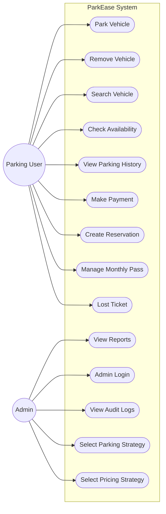
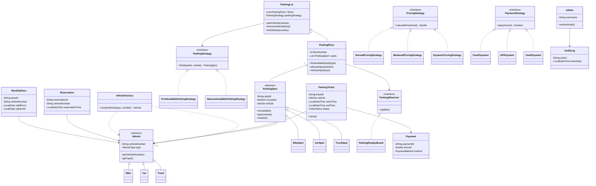
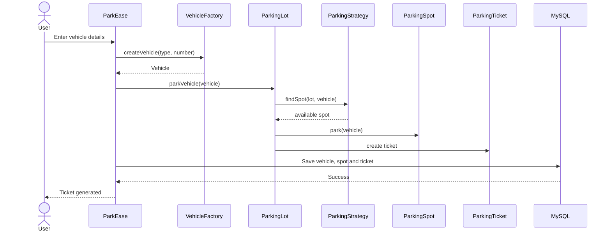
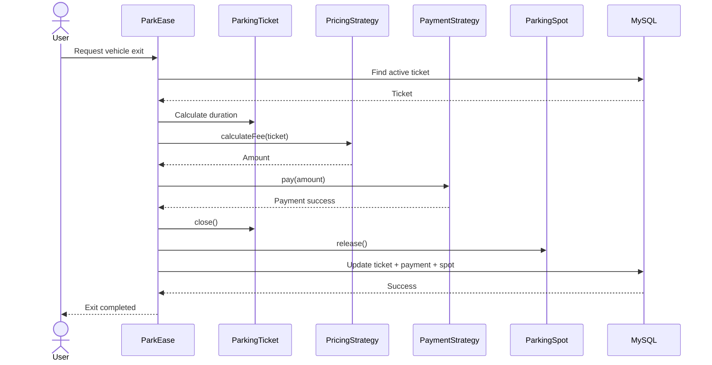
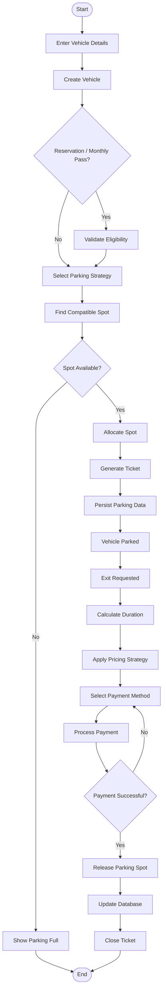
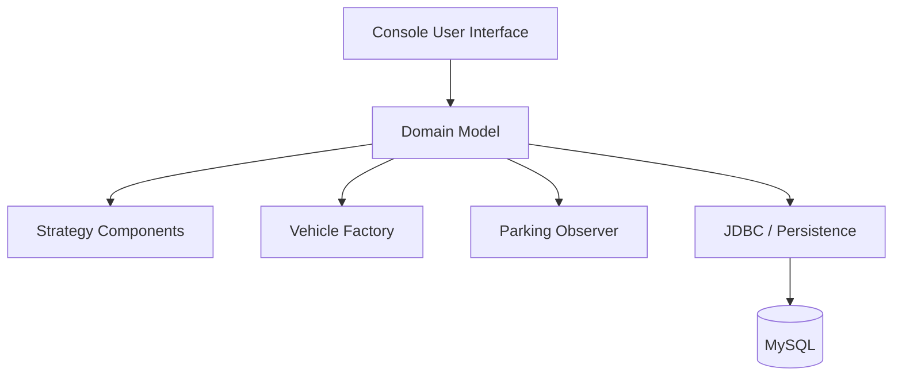
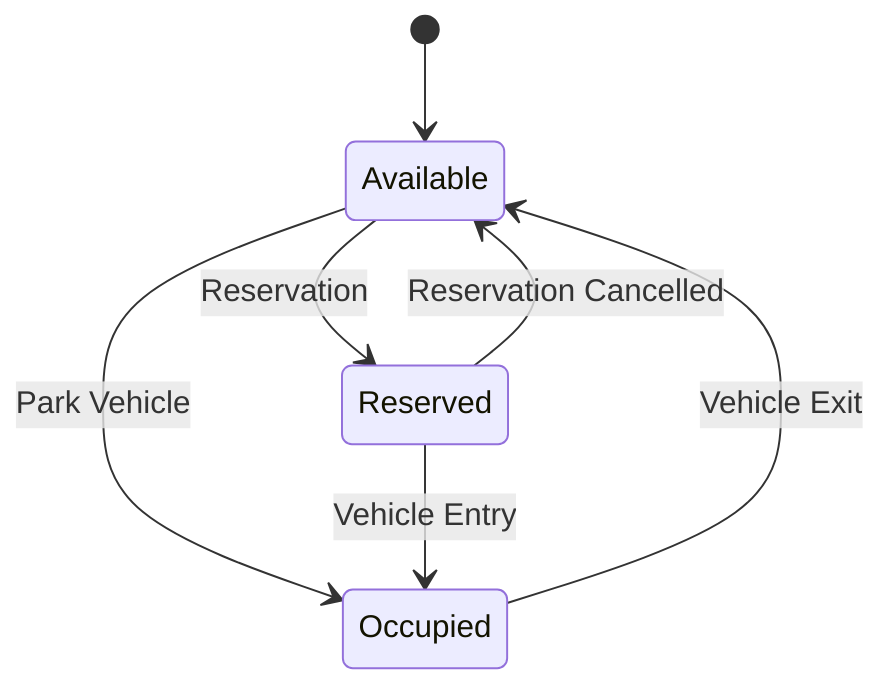

# ParkEase — UML Documentation

> Software-engineering UML documentation for the Smart Parking Management System.

## 1. Use Case Diagram

---

## 2. Class Diagram

---

## 3. Vehicle Entry — Sequence Diagram

---

## 4. Vehicle Exit — Sequence Diagram

---

## 5. Parking Activity Diagram

---

## 6. Component Diagram

---

## 7. Parking Spot State

---

## 8. Design Pattern Mapping

| Pattern | Component | Purpose |
|---|---|---|
| Strategy | ParkingStrategy | Slot allocation algorithm |
| Strategy | PricingStrategy | Parking fee calculation |
| Strategy | PaymentStrategy | Payment processing |
| Factory | VehicleFactory | Vehicle object creation |
| Observer | ParkingObserver | Parking availability updates |

---

## 9. Design Principles

### Single Responsibility
Major components focus on one responsibility such as parking, payment, pricing, persistence or vehicle creation.

### Open/Closed
New parking, pricing and payment strategies can be introduced through existing interfaces.

### Dependency on Abstractions
The core workflow depends on strategy interfaces rather than concrete implementations.

### Separation of Concerns
CUI interaction, business logic, domain modelling and database persistence have distinct responsibilities.
